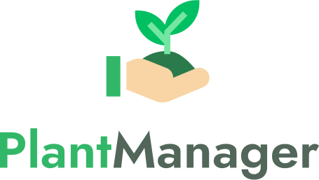

<h1 align="center">
  
</h1>

<p align="center">  
  
  
  

  

  <br>
  
  
  
  
  
   
</p>

<h3 align="center">
  Index
</h3>

<p align="center">
  🌱 <a href="#%EF%B8%8F-the-project">The Project</a>&nbsp;&nbsp;&nbsp;|&nbsp;&nbsp;&nbsp;
  🛠 <a href="#-technologies">Technologies</a>&nbsp;&nbsp;&nbsp;|&nbsp;&nbsp;&nbsp;
  🏁 <a href="#-starting-the-project">Starting</a>
</p>

<br>

## 🚀 Next Level Week #05 - PlantManager  
The Next Level Week is a project created by [RocketSeat](https://rocketseat.com.br/) to replace the OmniStack Week. 

The 5th edition differs from the 4th by bringing five different options of trails: ReactJS, React Native, Flutter, Node.js, and Elixir. 

This is the React Native trail!

<br>

**🎓  Instructor: [Rodrigo Gonçalves](https://br.linkedin.com/in/rodrigo-gon%C3%A7alves-santana)**<br>
**🎨  Layout made in [Figma](https://www.figma.com/) by [Tiago Luchtenberg](https://www.linkedin.com/in/tiago-luchtenberg-0b9a3b97/)**<br>

- [X] **19/04/2021** - Liftoff
- [X] **20/04/2021** - Maximum Speed
- [X] **21/04/2021** - In Orbit
- [X] **22/04/2021** - Landing
- [X] **23/04/2021** - Surface Exploration

<br> 

## 🌱 The Project:

The project consists of an app to manage the plants you have at home and remind you to water them.
<br>
<br>
<div align="center">
  
  
  
</div>

<div align="center">
  
  
  
</div>

<br>

### 🛠 Technologies
Developed with React Native, Expo and TypeScript.

- **[React Native](https://reactnative.dev/)**
- **[Expo](https://expo.io/)**
- **[TypeScript](https://www.typescriptlang.org/)**
<br>

## 🏁 Starting the project:

Clone the project: `git clone https://github.com/LiajuX/NextLevelWeek-PlantManager`

❗ **NOTE:** If you don't have yarn installed, use npm instead.
<br>

❗ **DOWNLOAD EXPO:** To run the project you need do install an app called Expo Go.
<br>
- 🤖 [Android Play Store](https://play.google.com/store/apps/details?id=host.exp.exponent)
- 🍎 [iOS App Store](https://itunes.com/apps/exponent)

<br>

📱 Execute the following commands to run the application:

````zsh

# to download the dependencies
$ yarn

# to start running the app
$ expo start

In another terminal tab:
# to run the server
$ yarn server
````
Now, you have to point your smartphone's camera to scan the QR Code displayed on the terminal or in the browser that'll open to open the application on Expo...

<br>

---

<h3 align="center" >
  Made by Júlia Brito(LiajuX)
</h3>
